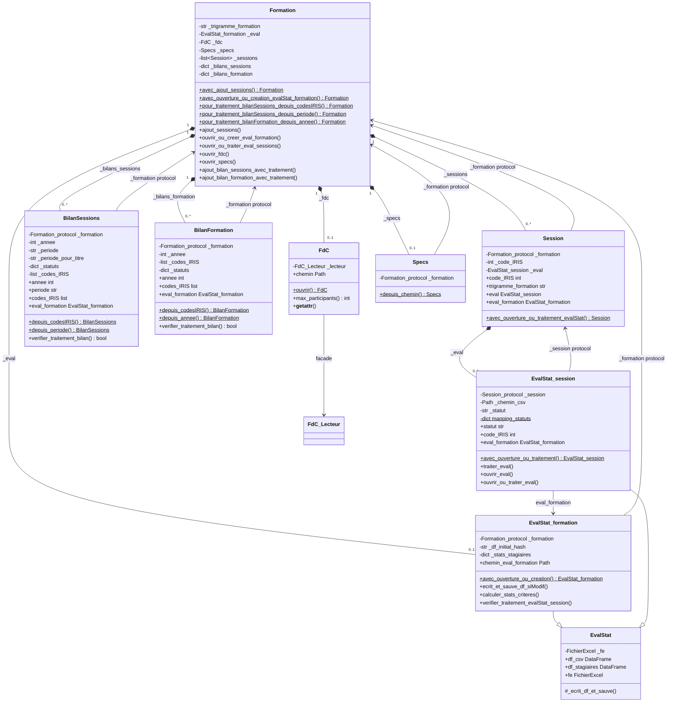
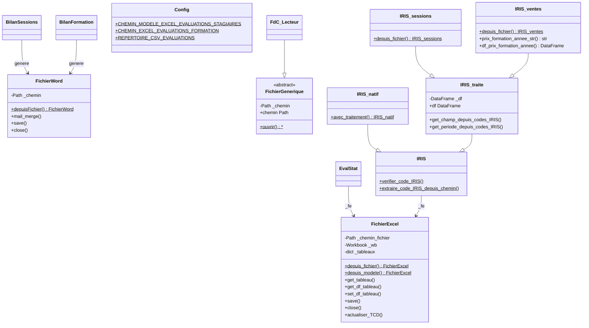
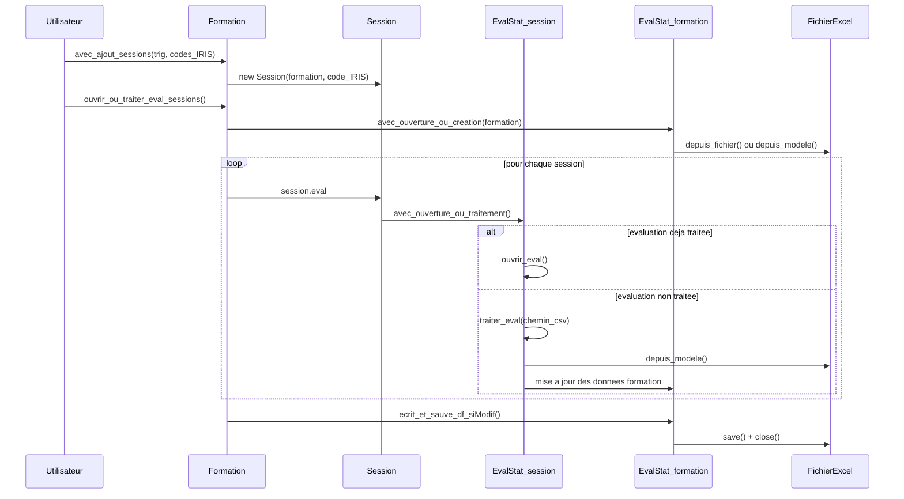
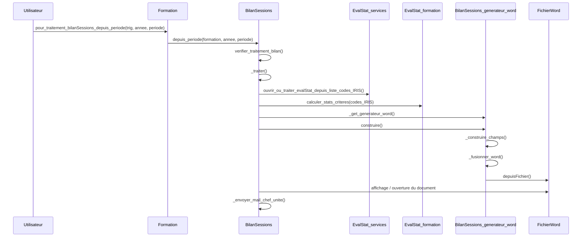
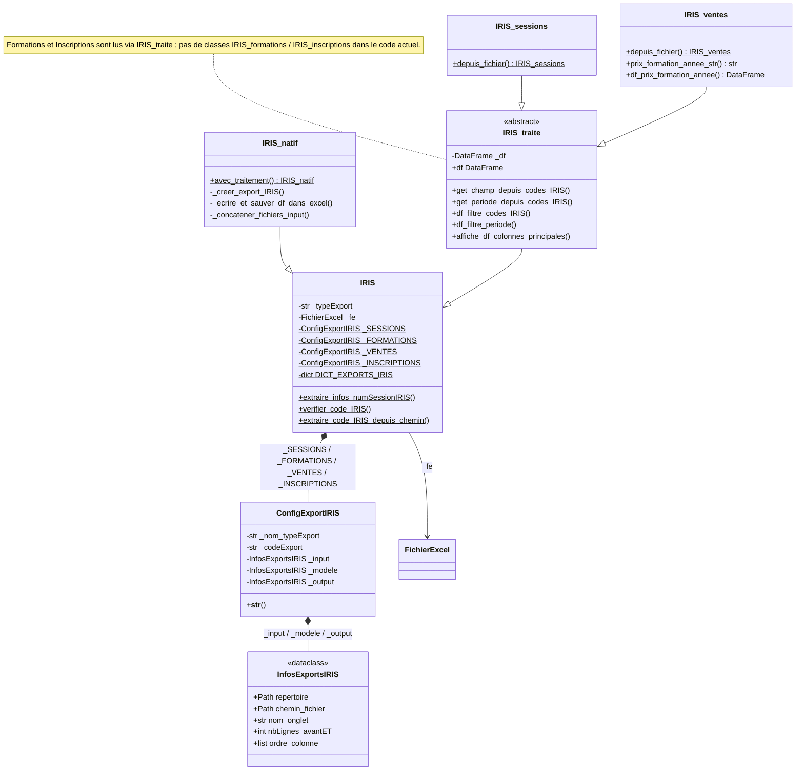
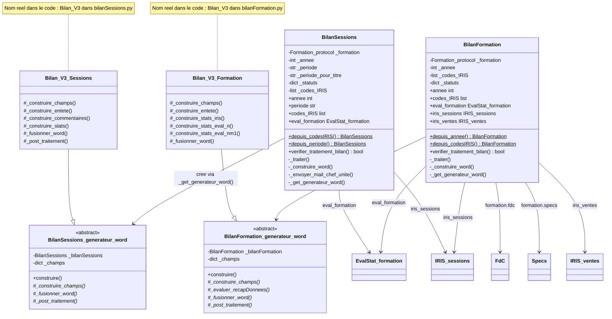
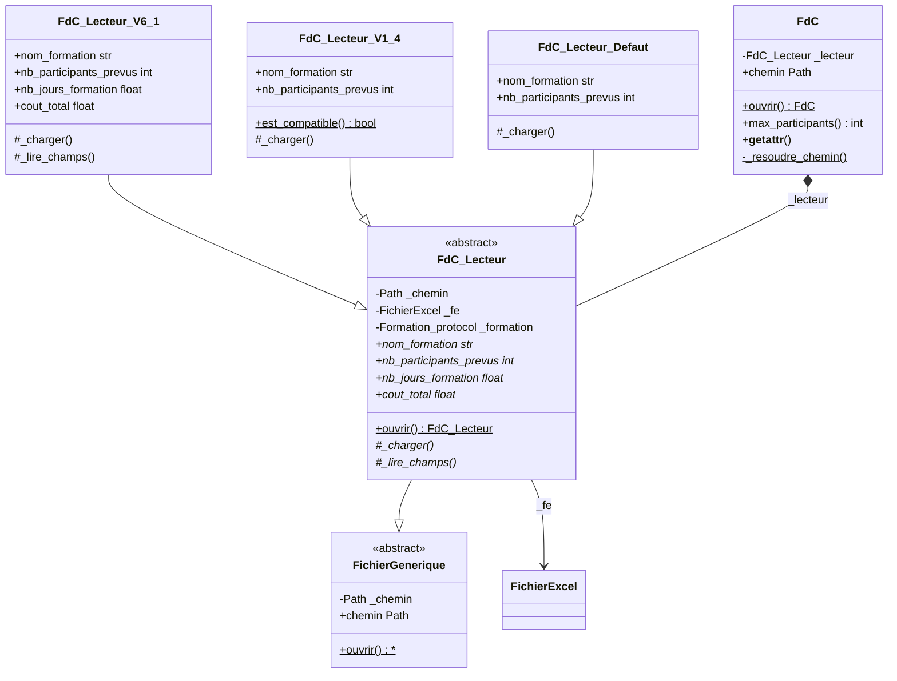
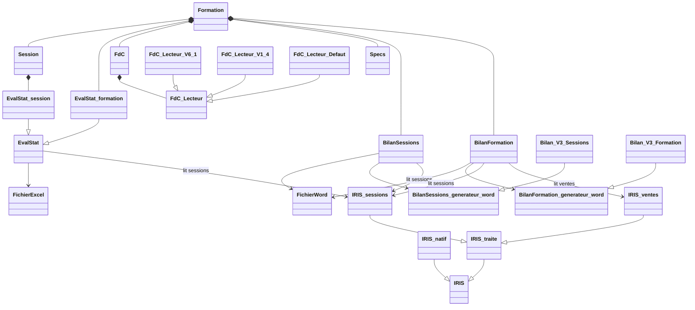

# UML - Projet VTE (INSTN / CEA)

Ce fichier regroupe les diagrammes Mermaid corriges d'apres le code actuel.

---

## Diagramme 1 - Classes du Domaine

---

## Diagramme 2 - Infrastructure (utils / core)

---

## Diagramme 3 - Sequence EvalStat

---

## Diagramme 4 - Sequence BilanSessions

---

## Diagramme 5 - IRIS detail complet

---

## Diagramme 6 - Bilans detail complet

---

## Diagramme 7 - FdC (Facade + Strategie)

---

## Diagramme 8 - Vue globale domaine complet

---

# Use cases

Les cas d'utilisation sont maintenant dans un fichier separe, plus propre et plus adapte :

➡ Voir `use_cases.md`

Ils sont ecrits en PlantUML, qui est le meilleur choix pour les diagrammes de cas d'utilisation.

---

# Versions PlantUML separees

Les diagrammes techniques de ce fichier existent aussi en fichiers PlantUML separes :

- `uml_01_classes_domaine.puml`
- `uml_02_infrastructure.puml`
- `uml_03_sequence_evalstat.puml`
- `uml_04_sequence_bilansessions.puml`
- `uml_05_iris_detail.puml`
- `uml_06_bilans_detail.puml`
- `uml_07_fdc_facade_strategie.puml`
- `uml_08_vue_globale_domaine.puml`

Le fichier `uml_00_index_plantuml.md` explique le role de chaque diagramme.
